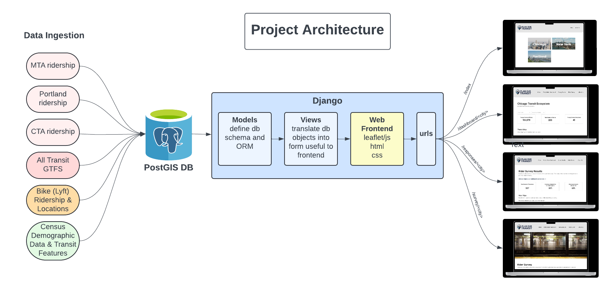

# Architecture and Deployment

## Architecture
High level overview of the architecure:


## Deployment

### Database
Currently we are working with a PostGIS database using a Postgres database that was set up by James (he has the credentials). 

If we need to deploy our own db, update here!

### Django App
#### Backend

To load the database tables:
1. Make sure you have all of the python dependencies installed
2. Make sure you have all of the database (and other) credentials in your `.env` folder
3. Install [gdal](https://gdal.org/index.html) in your machine
    - Run `brew install gdal` if using `homebrew`
    - If working on an Intel chip Mac, setup should be completed
    - If working on an M2 chip, on `app/geodajngo/settings.py` you'll need to import from a `.env` file (or manually) the `GDAL_LIBRARY_PATH` and `GEOS_LIBRARY_PATH` variables. If using `homebrew` head to `/opt/homebrew/Cellar` and identify the files `libgdal.dylib` and `libgeos_c.dylib` and set the path to the path of those files. 
4. Run:

For testing that the set up is correct we recomend launching the server locally as explained in `Frontend` below

5. Database tables should be established, you can double check by logging into the database using postico or some other postgres login tool

### Ingestion
The ingestion files are stored in `app.scripts/`. To ingest the data of one file with its default values run on the terminal in the `app/` directory `python -m manage runscript <module_name>`. Running it in this manner allows to use `django-extensions`, which deals with some of the Django settings necessary, particularly geographic data dependencies.

Some of the files can accept additional parameters, for these cases, the command is `python -m manage runscript <module_name> --script-args <arg_1> <arg_2> ...`

### Frontend
To run the webserver locally (again make sure you have dependencies installed and `.env` up to date)

Run:
```
cd app/
python -m manage runserver
```

#### Heroku Deployment
To deploy the production service, we are using heroku. 

Note: we applied for heroku education credits to deploy for free to heroku (this is a one time task)

If starting from scratch and setting up a new heroku application most of it is easy to do through the heroku web interface:

1. If starting a new heroku application, follow the instructions [here](https://devcenter.heroku.com/articles/ getting-started-with-python#set-up) which require you to `$ brew install heroku` for mac and `$ heroku login` to enter your heroku login credentials
2. From the web interface in the application `settings` add the following buildpacks: https://github.com/heroku/heroku-geo-buildpack.git, heroku/python, heroku/nodejs (the geo buildpack must come first to set up the gdal stuff prior to django). 
3. In the same web interface `settings` configure the `config vars` by copying in the keys and values from your `.env` file

You are now ready to deploy, the following steps are repeated every time you deploy:
1. From the root of your repo (i.e. `RouteRangers/`), generate a new `requirements.txt` to reflect any poetry updates:
```
poetry export --without-hashes --format=requirements.txt > requirements.txt
```
2. Then to deploy, commit your changes to the branch you are working on and are ready to deploy:
```
git add --all
git commit -m "<your commit message>"
git push
```
And then push to heroku:
```
git push heroku <your current branch>:main
```
Or if you are on main I think you can just run:
```
git push heroku main
```

Then if the full deployment script runs through you can check the given url that the changes have been reflected. 

If there are no errors in deployment but the frontend doesn't run as expected:
1. Check the logs `$ heroku logs --tail` 
2. If the logs don't show anything obvious and you are just getting a vague error in the frontend (ex. error 500), check the `app/geodjango/settings.py` file and uncomment the heroku  `DEBUG=True` around line 48-49 to surface errors more effectively (only while debugging!!)


