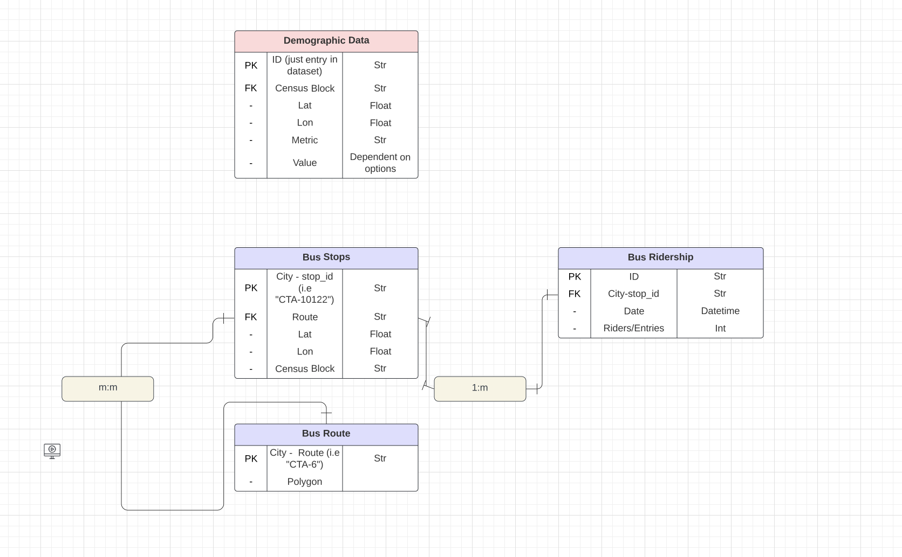
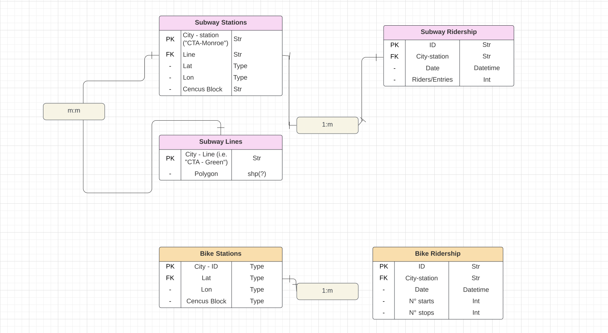

# Datamodel prototype 

The datamodel prototype can be found in the following [lucidchart link](https://lucid.app/lucidchart/acedfe58-359d-42ba-8dc9-b9421517ead9/edit?invitationId=inv_a9fee266-b5b0-4243-bfa8-ccf7f44afd22&referringApp=slack&page=0_0#)

In the diagram, each table has three features, the first column, identifies if a variable is categorized as Primary Key, Foreign Key or none, the second column represent the variable in the table –and therefore one column on the database–, and the third column represents the datatype.

Relationships between tables are specified by the lines connecting multiple tables. In the diagram its specified the type of matching expected, where 1:1 represents a one to one matching, m:1 many to one, and m:m many to many. 

